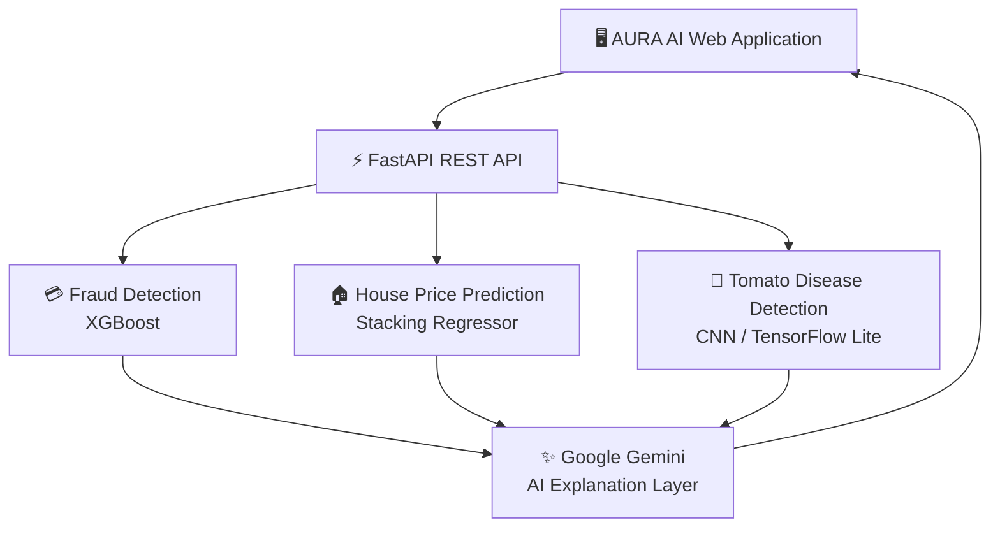
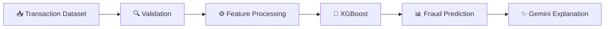
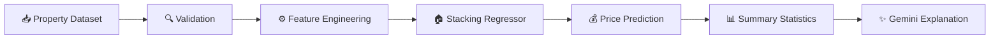
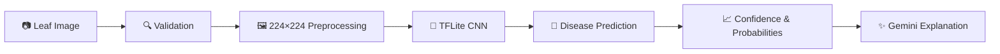
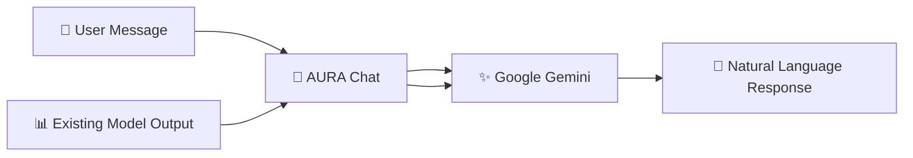

# 🚀 AURA AI

### Multi-Model AI Platform for Intelligent Prediction, Detection & AI-Powered Explanations

<p align="center">
  
  
  
  
</p>

<p align="center">
  
  
  
  
</p>

<p align="center">
  
  
  
</p>

---

## 📌 Overview

**AURA AI** is a multi-model Artificial Intelligence platform developed as part of the **Huawei AI Training Program**.

The platform brings together **Machine Learning, Deep Learning, Computer Vision, and Generative AI** inside one unified application.

AURA AI currently integrates three independent AI models:

- 💳 **Credit Card Fraud Detection** — XGBoost Classification
- 🏠 **House Price Prediction** — Stacking Regression
- 🍅 **Tomato Leaf Disease Detection** — DenseNet121 / TensorFlow Lite

On top of these models, **Google Gemini** acts as an AI explanation and conversational layer. Gemini explains model outputs and allows users to interact with the results using natural language without replacing the underlying model predictions.

---

## 🎯 Project Highlights

| Capability | Description |
|---|---|
| 🤖 Multi-Model AI | Three independent AI models integrated into one platform |
| 💳 Fraud Detection | Detect potentially fraudulent credit-card transactions |
| 🏠 Regression | Estimate residential property prices |
| 🍅 Computer Vision | Classify tomato leaf diseases from images |
| ✨ Generative AI | Gemini-powered explanations and conversation |
| ⚡ REST API | FastAPI backend exposing all AI services |
| 📊 Batch Prediction | CSV/Excel dataset processing where supported |
| ☁️ Cloud Deployment | Production backend deployed on Railway |
| 🔐 Environment Security | API credentials stored through environment variables |

---

# 🧠 AI Models

## 💳 1. Credit Card Fraud Detection

The Fraud Detection module classifies credit card transactions and determines whether a transaction is potentially fraudulent.

### Model

**XGBoost Classifier**

XGBoost is used as the core classification algorithm for structured transaction data.

### Supported Input

- Single transaction data
- CSV datasets
- Excel datasets

### Output

- Fraud / Legitimate classification
- Prediction result
- Model probability information

### Performance

**Accuracy: 99.98%**

---

## 🏠 2. House Price Prediction

The House Price module estimates residential property prices based on structured property characteristics.

### Model

**Stacking Regressor Pipeline**

The pipeline combines multiple regression estimators to produce the final prediction.

### Feature Engineering

Before inference, the API performs the required feature transformations, including:

- `TotalSF`
- `TotalPorchSF`
- `TotalBath`
- `HouseAge`
- `RemodAge`
- Quality ordinal encoding

The model also handles the required logarithmic target transformation and applies the inverse transformation to return the predicted price in the original scale.

### Output

For uploaded property datasets, the API returns:

- Property-level predictions
- Minimum predicted price
- Maximum predicted price
- Mean predicted price
- Median predicted price

### Performance

**Accuracy: 94.5%**

---

## 🍅 3. Tomato Leaf Disease Detection

The Tomato Disease module is a Computer Vision system that classifies tomato leaf images into disease/health categories.

### Model

**DenseNet121-based CNN**

For production deployment, the trained model is served as a **TensorFlow Lite (`.tflite`) model** to reduce deployment size and improve CPU-based inference compatibility.

### Supported Images

- `.jpg`
- `.jpeg`
- `.png`
- `.webp`

### Processing Pipeline

```text
Image Upload
     ↓
Image Validation
     ↓
Resize to 224 × 224
     ↓
Model Preprocessing
     ↓
TensorFlow Lite Inference
     ↓
Class Probabilities
     ↓
Predicted Disease + Confidence
```

### Output

- Predicted class
- Confidence score
- Top class probabilities

### Classes

The application supports **10 Tomato Leaf Disease classes** through the accompanying class-name metadata file.

### Performance

**Accuracy: 99.5%**

---

# ✨ Google Gemini Integration

Google Gemini is integrated as the **Generative AI explanation and conversation layer**.

The architecture intentionally separates model authority from natural-language generation:

```text
Traditional AI Models
        │
        ▼
   Model Prediction
        │
        ▼
   Google Gemini
        │
        ▼
Natural Language Explanation
        │
        ▼
      AURA AI
```

### Gemini Responsibilities

Gemini can:

- Explain Fraud Detection results
- Explain House Price predictions
- Explain Tomato Disease predictions
- Provide contextual guidance
- Discuss model outputs conversationally
- Answer normal user questions through the chat interface

### Model Authority

Gemini does **not** replace or modify the predictions generated by the trained ML/DL models.

The architecture follows:

> **Prediction → Explanation → Conversation**

This keeps the trained models responsible for predictions while Gemini provides the conversational intelligence around those results.

---

# 🏗️ System Architecture



---

# 🔄 Model Processing Workflows

## 💳 Fraud Detection Workflow



## 🏠 House Price Workflow



## 🍅 Tomato Disease Workflow



---

# 💬 Conversational AI Workflow

Normal user messages are handled separately from model-specific input workflows.



This allows users to:

- Ask AURA normal questions
- Discuss an existing prediction
- Ask for clarification about a model output
- Request explanations
- Continue a conversation without re-running the model unnecessarily

---

# 🔌 API Endpoints

## 💳 Fraud Detection

### Single Prediction

```http
POST /predict/fraud
POST /api/predict/fraud
```

### CSV Batch Prediction

```http
POST /predict/fraud/csv
POST /api/predict/fraud/csv
```

### Excel Batch Prediction

```http
POST /predict/fraud/excel
POST /api/predict/fraud/excel
```

---

## 🏠 House Price Regression

```http
POST /predict/house-price/csv
POST /api/predict/house-price/csv
```

---

## 🍅 Tomato Leaf Disease

```http
POST /predict/cnn/image
POST /api/predict/cnn/image
```

---

## ✨ Gemini AI

### Fraud Explanation

```http
POST /api/ai/analyze
```

### House Price Explanation

```http
POST /api/ai/analyze-regression
```

### Disease Explanation

```http
POST /api/ai/analyze-disease
```

---

# 🛠️ Technology Stack

| Technology | Role |
|---|---|
| 🐍 **Python 3.13** | Backend and AI development |
| ⚡ **FastAPI** | REST API backend |
| 📊 **Scikit-learn** | ML pipelines and preprocessing |
| 🚀 **XGBoost** | Fraud classification |
| 🧠 **TensorFlow** | Deep Learning |
| 📱 **TensorFlow Lite** | Lightweight CNN inference |
| 👁️ **DenseNet121** | Tomato image classification |
| ✨ **Google Gemini** | Generative AI and explanations |
| 🟨 **JavaScript** | Frontend application logic |
| ☁️ **Railway** | Production deployment |
| 🐙 **GitHub** | Version control and source hosting |

---

# 📁 Project Structure

```text
AURA-AI/
│
├── nexa-ai-api/
│   │
│   ├── api/
│   │   └── index.py
│   │
│   ├── models/
│   │   ├── fraud_model.joblib
│   │   ├── fraud_scaler.joblib
│   │   ├── house_price_model.joblib
│   │   ├── house_price_model_info.joblib
│   │   ├── tomato_leaf_disease_model.tflite
│   │   └── tomato_class_names.json
│   │
│   ├── test_api.py
│   ├── requirements.txt
│   └── ...
│
├── js/
│   ├── api.js
│   ├── models.js
│   └── chat.js
│
├── index.html
├── README.md
└── ...
```

---

# 🧩 Frontend Architecture

The frontend uses Vanilla JavaScript and separates API communication, model rendering, and chat behavior.

### `js/api.js`

Provides the API abstraction layer for:

```text
NEXA_API.fraud.uploadDataset(file)
NEXA_API.regression.uploadDataset(file)
NEXA_API.cnn.analyzeImage(file)

NEXA_API.ai.analyzeFraud(payload)
NEXA_API.ai.analyzeRegression(payload)
NEXA_API.ai.analyzeDisease(payload)
```

### `js/models.js`

Responsible for rendering:

- Upload interfaces
- Prediction tables
- Summary statistics
- Pagination
- CNN probability bars
- Gemini explanation cards
- AI fallback notices

### `js/chat.js`

Handles conversational workflows and quick actions, including:

```text
Analyze Image (CNN)
Classify Features
Predict Outcome
```

Each quick action triggers its dedicated workflow instead of relying on generic free-text intent detection.

---

# 📊 Model Performance

| Model | Task | Architecture | Performance |
|---|---|---|---:|
| 💳 Fraud Detection | Classification | XGBoost | **99.98% Accuracy** |
| 🏠 House Price | Regression | Stacking Regressor | **94.5%** |
| 🍅 Tomato Disease | Image Classification | DenseNet121 / TFLite | **99.5% Accuracy** |

> **Note:** Performance values represent the evaluation results obtained during the project's model development and testing process.

---

# 🧪 Testing & Validation

The project includes backend API tests covering the major prediction workflows.

The test suite validates:

- ✅ Root endpoints
- ✅ Health endpoints
- ✅ Fraud single prediction
- ✅ Fraud CSV prediction
- ✅ Fraud Excel prediction
- ✅ Missing-column validation
- ✅ Non-numeric input validation
- ✅ Empty-file validation
- ✅ Invalid-extension validation
- ✅ House Price regression
- ✅ Tomato Disease classification
- ✅ Gemini API fallback behavior
- ✅ Scaler equivalence

The three core model pipelines were successfully integrated and tested through their production API workflows.

---

# ☁️ Deployment

The backend is deployed using **Railway**.

### Production Architecture

```text
GitHub Repository
       │
       ▼
   Railway
       │
       ▼
 FastAPI Backend
       │
       ├── Fraud Model
       ├── House Price Model
       ├── Tomato TFLite Model
       └── Gemini API
```

The application is configured to run the FastAPI server on the deployment-provided port and exposes the REST endpoints required by the frontend.

---

# 🔐 Environment Variables

Sensitive credentials are kept outside the source code.

Example:

```env
GEMINI_API_KEY=your_gemini_api_key
```

The API key should **never** be committed to GitHub.

---

# 🚀 Local Setup

## 1. Clone the repository

```bash
git clone https://github.com/YOUR_USERNAME/YOUR_REPOSITORY.git
cd YOUR_REPOSITORY
```

## 2. Create a virtual environment

### Windows

```bash
python -m venv .venv
.venv\Scripts\activate
```

### Linux / macOS

```bash
python3 -m venv .venv
source .venv/bin/activate
```

## 3. Install dependencies

```bash
pip install -r requirements.txt
```

## 4. Configure environment variables

Create a `.env` file:

```env
GEMINI_API_KEY=your_gemini_api_key
```

## 5. Start FastAPI

```bash
uvicorn api.index:app --reload
```

The API will be available at:

```text
http://127.0.0.1:8000
```

Interactive API documentation:

```text
http://127.0.0.1:8000/docs
```

---

# 🖥️ API Documentation

FastAPI automatically provides interactive API documentation through Swagger UI.

Once the backend is running:

```text
/docs
```

You can test:

- Fraud endpoints
- House Price endpoints
- CNN image prediction
- Gemini explanation endpoints
- Health checks

directly from the browser.

---

# 🔐 Design Principles

### 1. Model Authority

The trained ML/DL models remain responsible for predictions.

### 2. Independent Workflows

Each model has its own input format, preprocessing and inference pipeline.

### 3. Separation of Concerns

The frontend, API layer, ML models and Gemini layer have clearly separated responsibilities.

### 4. Production-Oriented Deployment

Models are exposed through FastAPI and deployed through Railway.

### 5. Lightweight Computer Vision Deployment

The Tomato Disease model is deployed using TensorFlow Lite to reduce model footprint and improve deployment compatibility.

---

# 🎓 Huawei AI Training Project

AURA AI was developed as a final practical project within the **Huawei AI Training Program**.

The project combines concepts and practical skills from:

- Machine Learning
- Deep Learning
- Computer Vision
- Model Evaluation
- API Development
- Generative AI
- Cloud Deployment
- AI System Integration

The goal was to demonstrate how multiple AI technologies can be integrated into one practical, production-oriented application.

---

# 👥 Team

### Team Members

- 👤 @YOUR_FRIEND_1
- 👤 @YOUR_FRIEND_2
- 👤 @YOUR_FRIEND_3
- 👤 @YOUR_FRIEND_4
- 👤 @YOUR_FRIEND_5

### Instructor

- 🎓 @YOUR_INSTRUCTOR

---

# 🔗 Project Links

### 💻 GitHub Repository

[View Source Code](https://github.com/YOUR_USERNAME/YOUR_REPOSITORY)

### 🌐 Frontend Demo

[Open Frontend Demo](YOUR_FRONTEND_LINK)

> ℹ️ The live demo link represents the **frontend interface**. The AI backend is deployed separately through Railway.

### ⚡ Backend API

[Open API Documentation](YOUR_RAILWAY_URL/docs)

---

# 🔮 Future Improvements

Potential future development includes:

- 📈 Advanced model monitoring
- 📊 Interactive analytics dashboards
- 🧠 Explainable AI visualizations
- 🍅 Additional plant disease classes
- 💳 More fraud detection scenarios
- 🏠 Additional property datasets
- 👤 User authentication
- 🗃️ Prediction history
- 📱 Mobile application
- 💬 Extended conversational memory
- 🔔 Real-time AI notifications

---

# 📜 License

This project was developed for educational and training purposes as part of the **Huawei AI Training Program**.

---

<div align="center">

## 🚀 AURA AI

### Predict. Detect. Explain.

**Machine Learning · Deep Learning · Computer Vision · Generative AI**

Made with ❤️ by the AURA AI Team

</div>
